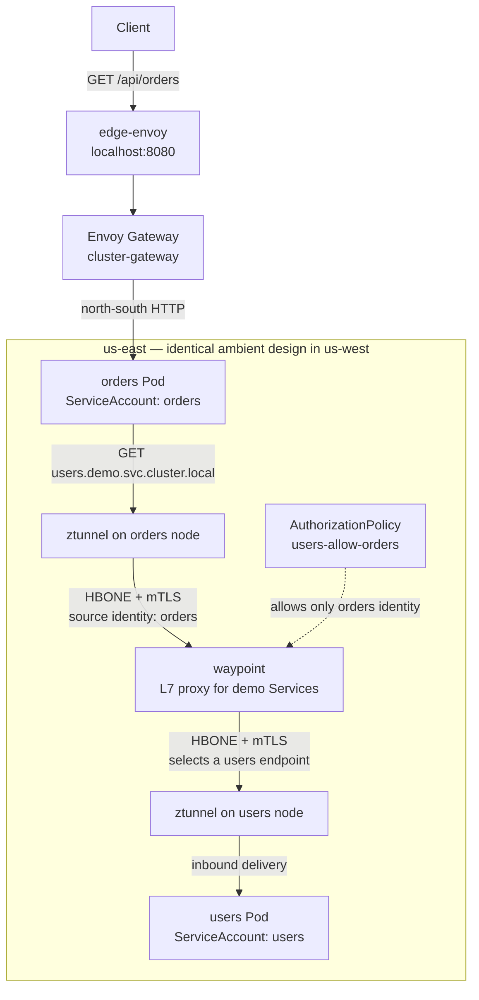

# Phase 4 — Istio ambient mode

**Goal:** Sidecar-less mesh in each cluster: ztunnel for mTLS at L4, a waypoint proxy for L7 policy, and an AuthorizationPolicy so only `orders` may call `users`.

## Result

Each kind cluster now has an independent Istio ambient installation. Istio CNI redirects traffic
from pods in the `demo` namespace to the node-local `ztunnel`; ztunnel supplies workload identity
and mutual TLS for in-mesh connections without changing either application Pod. A namespace
waypoint processes Service traffic before it reaches the destination workload.

`orders` and `users` each run under a dedicated Kubernetes ServiceAccount. The `users-allow-orders`
AuthorizationPolicy is attached to the `users` Service by `targetRefs`, which makes the waypoint
evaluate the caller's SPIFFE principal. It allows only
`cluster.local/ns/demo/sa/orders`. A request from the `orders` application to `users` therefore
uses both the encrypted ambient path and the waypoint authorization check.



The initial request is still handled by the Phase 3 edge and cluster gateways. `orders` then makes
its normal in-cluster request to the `users` Service. Because both workloads are ambient enrolled,
Istio CNI transparently redirects that request to the source node's ztunnel. Ztunnel recognizes that
the destination Service uses `waypoint`, creates the first encrypted HBONE hop, and supplies the
`orders` workload identity to the waypoint. The waypoint evaluates `users-allow-orders`, selects a
`users` endpoint, and creates the second encrypted HBONE hop to the ztunnel on that endpoint's node.
The destination ztunnel delivers the request to the `users` Pod.

The policy attaches to the `users` Service, so the waypoint—not ztunnel—performs the caller check.
That is what permits later L7 rules such as HTTP method or path constraints. The two clusters remain
separate meshes in this phase; no east-west gateway or shared trust domain is configured until
Phase 5.

## What is installed

`make up` now runs `scripts/install-istio-ambient.sh` for the selected cluster after Envoy Gateway
is ready. The script uses the `ambient` Istio profile, which installs `istiod`, Istio CNI, and the
`ztunnel` DaemonSet, and waits for all three before the application manifests are applied. It is
safe to re-run:

```bash
make up
make up CLUSTER=us-west
```

For an existing Phase 3 lab, the same commands reconcile each cluster and enroll the application
namespace; no teardown is needed. `istioctl` must be installed, as listed in the repository
prerequisites.

The Makefile pins the matching `istioctl` client to `1.31.0`; use the same release, or explicitly
override the check when intentionally using another installed client:

```bash
make up ISTIO_VERSION="$(istioctl version --remote=false | sed -n 's/^client version: //p')"
```

The application Kustomize base contains the ambient resources so both overlays receive the same
security configuration:

- `Namespace/demo` has `istio.io/dataplane-mode: ambient` and
  `istio.io/use-waypoint: waypoint` labels.
- `Gateway/waypoint` uses the `istio-waypoint` GatewayClass, a `mesh` listener, and port `15008`
  with `HBONE` protocol. Istio creates and manages its backing waypoint workload.
- `AuthorizationPolicy/users-allow-orders` targets the `users` Service and allows only the
  `orders` ServiceAccount principal.

The authorization rule is intentionally service-to-service. Existing north-south HTTPRoutes stay
in place for the earlier routing demos; traffic arriving through the non-Istio Envoy Gateway does
not traverse this service waypoint. In ambient mode, a service-targeted policy governs traffic that
uses that service's waypoint. Making a waypoint mandatory for every possible direct path would need
an additional ztunnel-enforced L4 policy and an ingress design that sends north-south traffic
through the waypoint; that stricter boundary is outside this phase.

## Inspect and verify

Check the ambient components and the waypoint in either cluster:

```bash
kubectl --context kind-us-east get pods -n istio-system
kubectl --context kind-us-east get gateway,pods -n demo
kubectl --context kind-us-east get authorizationpolicy -n demo
```

The ztunnel DaemonSet should have one ready Pod per kind node. The waypoint Gateway should report
`Programmed=True`, and its managed proxy Pod has the
`gateway.istio.io/managed=istio.io-mesh-controller` label.

`make status` includes the same ztunnel, waypoint, and policy summary for the selected cluster.

To see the allowed `orders` → `users` application call, request `orders` through the normal edge
or cluster gateway. The JSON response includes the nested `users` response:

```bash
make edge-up
curl -s http://localhost:8080/api/orders
```

The workload identity in the policy is the important check: a different ambient ServiceAccount
does not match the allow-list and receives a denied response from the waypoint when it calls the
`users` Service.

## Cleanup

`make down` still removes both kind clusters and therefore all Istio resources with them. To remove
only one cluster and its ambient installation, use:

```bash
make down-cluster CLUSTER=us-west
```
